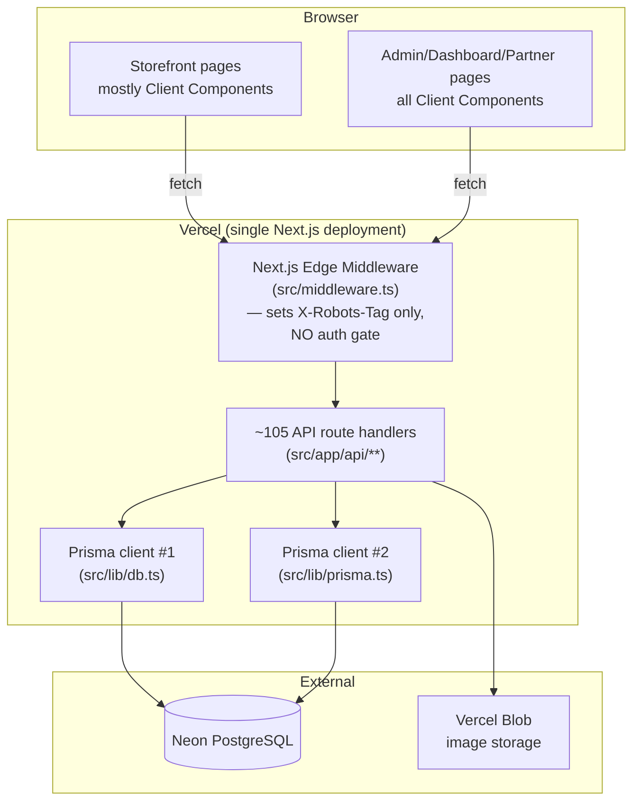

# 03 — Current Architecture

## 1. Architecture style

SkyZoneBD is a **single Next.js App Router monolith** — one deployable unit serving server-rendered pages, client-rendered pages, and ~105 API route handlers from one codebase, backed by one Postgres database via one Prisma client. There is no service boundary of any kind (no separate services, no message queue, no background worker process distinct from the request/response cycle). This is an entirely reasonable architecture for the current scale (single tenant, single region, one database) — the problems documented below are internal-organization problems (layering, consistency, duplication), not a case for premature microservice decomposition.

## 2. Layering — as designed vs. as built

**As nominally designed** (visible in directory structure): `app/api` (transport/HTTP) → `services/` (application/orchestration) → `utils/`+`lib/` (domain logic/infrastructure) → Prisma (persistence). This is a reasonable three-tier shape.

**As actually built**: the layering is honored inconsistently.
- Several of the best-designed pieces of domain logic (`src/services/orderFulfillmentService.ts` with real FIFO/WAC costing and atomic returns, `src/utils/salesGeneration.ts`'s auto-sale-on-delivery logic) are **fully implemented but never called from any route** — the route handlers reimplement simpler versions of the same logic inline instead of calling the service layer that exists for exactly that purpose. The service layer is aspirational in these cases, not authoritative.
- Most API route handlers talk to Prisma directly rather than through `services/`, especially in the admin surface — `src/app/api/admin/*` routes contain business logic (profit math, stock math, discount math) inline in the route handler rather than delegating to `utils/`.
- The frontend has **two competing data-access strategies**: a genuine layered abstraction for the public storefront (`hooks/useProducts.ts` → `services/dataService.ts` → `services/apiService.ts`), and a second, unlayered pattern for the entire admin/dashboard/partner/customer surface where every page hand-writes its own `fetch` + `localStorage` token read + response-shape assumption, duplicated 2–3 times per resource (once under `/admin`, again under `/dashboard`, sometimes again under `/customer`/`/partner`).

## 3. Coupling & duplication (structural, not code-line, duplication)

The strongest architectural signal in this codebase is **parallel, non-unified subsystems for the same concept**, repeated at every layer:

| Concept | Parallel implementations found |
|---|---|
| "A sale happened" | `Order`+`OrderItem` (online), `Sale` (direct/order-based ledger), `ManualSalesEntry`+`ManualSalesItem` (offline entry) — three independent models, three independent cost/profit snapshot calculations |
| "Compute profit" | `utils/profitCalculation.ts`, `utils/comprehensiveProfitCalculation.ts`, `utils/partnerProfitDistribution.ts`, `services/orderFulfillmentService.ts` — four independent formulas over four different data sources (`Order`, `Sale`, stock lots), none calling each other, no shared "Profit" primitive |
| "Who is authenticated/authorized" | `lib/auth.ts`'s JWT+role helpers, an inline `verifyAdminToken` variant, a bespoke per-file `verifyPartner()`, and `middleware/permissionMiddleware.ts`'s unauthenticated `x-user-id`-header trust — four mechanisms, inconsistently applied per route (full detail in `08_Security_Assessment.md`) |
| "Who gets a profit share" | `User.isProfitPartner`, `Product.sellerId`/`sellerCommissionPercentage`, standalone `Partner` model — three disconnected representations |
| "Admin panel" | `src/app/admin/*` (primary, linked in nav) and `src/app/dashboard/*` (a substantially complete second admin panel, reimplementing the same CRUD screens against the same endpoints with independent fetch logic) |
| Prisma client singleton | `src/lib/db.ts` and `src/lib/prisma.ts` — two independently-configured client instances, imported inconsistently across routes |

This pattern — not any single bug — is the dominant architectural characteristic of the codebase, and is the direct, structural consequence of incremental, non-architecture-first, prompt-by-prompt development: each new feature request appears to have been implemented as a fresh, self-contained unit rather than by extending an existing one, because no single existing implementation was ever established as canonical.

## 4. Transaction boundaries

- **Correctly atomic**: order creation (order + order-items + stock decrement) is one `prisma.$transaction`. Manual-sales creation (sale + stock + ledger) is one transaction. `orderFulfillmentService.ts`'s (unused) delivery/return flow is correctly transactional.
- **Not atomic (real risk)**: both order-cancellation code paths restore stock via a loop of independent, sequential `prisma.product.update` calls *outside* any `$transaction`, with the order's status flip happening either before or after that loop depending on which of the two cancellation endpoints is used — a mid-loop failure leaves stock and order status inconsistent with each other. The live profit-finalization flow (`autoGenerateProfitReport`) creates the `ProfitReport` row and updates `Order` in sequential awaits (not one transaction), then creates `FinancialLedger` entries in a `try/catch` that **explicitly swallows failures** — meaning a delivered order can have a profit report with no corresponding ledger entries, silently, by design.

## 5. Module boundaries & package organization

Directory organization (`lib/`, `services/`, `utils/`, `types/`, `contexts/`, `components/`) is a reasonable technical-layer split but is **not** organized by business module/bounded context — pricing logic for the Order domain, Product domain, and Partner domain all live side-by-side in one flat `utils/` folder with 18 files and no subfolders, making it hard to see which utilities belong to which business capability at a glance. There is also a second, separate `src/app/components/` directory (app-shell UI: Header, ProductCard, ProtectedRoute, etc.) distinct from the top-level `src/components/` (feature-area components: reviews, rfq, payouts, wholesale, seo) — two "components" locations with no documented rule for which new components go where.

## 6. Dependency direction

Broadly sound in one direction (routes depend on utils/services depend on Prisma; nothing in `utils/`/`services/` imports from `app/`), but violated by the `pg` package being a listed, unused dependency (no direct-driver code found) and by `src/lib/ordersStore.ts` — a fully dead, in-memory pre-Prisma prototype module, importable but imported by nothing, that should not exist in the current dependency graph at all.

## 7. Security risk summary

Full detail in `08_Security_Assessment.md`. Headline: there is no single, framework-level authentication gate — `src/middleware.ts` performs no auth check at all (only sets an `X-Robots-Tag` header) — so every route is individually responsible for its own auth, and a meaningful fraction of the admin surface has none. This is the single highest-priority architectural finding in the entire review.

## 8. Scalability & performance observations

- **Neon pooled connection only** — `directUrl`/unpooled connection exists in the environment but is not wired into `schema.prisma`, so `prisma migrate deploy` (run on every Vercel build per `vercel.json`) executes over the pooled connection rather than the unpooled one Neon recommends for migrations/long-running DDL.
- **Two independent Prisma client singletons** (`lib/db.ts`, `lib/prisma.ts`), inconsistently imported, risk doubled connection-pool usage under concurrent serverless invocations, especially combined with routes that explicitly call `prisma.$disconnect()` in a `finally` block (connection churn).
- **Missing indexes on hot filter columns**: `Product.categoryId`, `Product.sellerId`, `Product.isActive`, `Product.isFeatured` have no `@@index` despite being the primary storefront/admin filter columns; Postgres does not auto-index foreign keys.
- **Unbounded list queries**: `GET /api/orders` (admin branch), `GET /api/rfq`, `GET /api/admin/employees`, `GET /api/admin/salaries`, `GET /api/admin/costs`, `GET /api/admin/distributions`, `GET /api/admin/partners`, `GET /api/admin/payment-config` all call `findMany` with no pagination — will degrade linearly as data grows. A real, shared pagination helper (`src/lib/paginationHelper.ts`) exists and is well-built, but is adopted by only a subset of list endpoints; others hand-roll different pagination shapes or omit pagination entirely.
- **N+1 patterns**: `customer/analytics` issues 5 sequential (non-`Promise.all`) queries; `partner/financial/distributions` issues one extra query per distribution row inside a `Promise.all(map(...))`; `admin/profit-reports/dashboard`'s 6-month trend loop issues 3 queries × 6 months sequentially.

## 9. Maintainability, extensibility, testability

- **Maintainability**: lowered materially by the four-way duplication pattern in §3 — a bug fix or business-rule change (e.g., "how is profit computed") must be found and fixed in up to four places, and there is no way to know from the code alone which of the four is authoritative without tracing actual call sites (as this review did).
- **Extensibility**: the wholesale pricing engine (`pricingEngine.ts`) is a genuine bright spot — well isolated, pure-function, thoroughly unit-tested, and is the one piece of domain logic actually reused consistently (cart preview, order creation, quote generation). New pricing rules could extend this safely. Conversely, extending "profit reporting" safely requires first picking (or unifying) one of four existing implementations.
- **Testability**: the shared `lib/error-handler.ts` (typed error classes, `NODE_ENV`-aware error masking) and `lib/validation.ts` (zod schemas for most domain objects) are well-designed for testability but are **not used** by the majority of live route handlers, which hand-roll `try/catch` and manual field checks instead — meaning the parts of the codebase most amenable to unit testing are not the parts actually running in production. See `09_Code_Quality_Report.md`.
