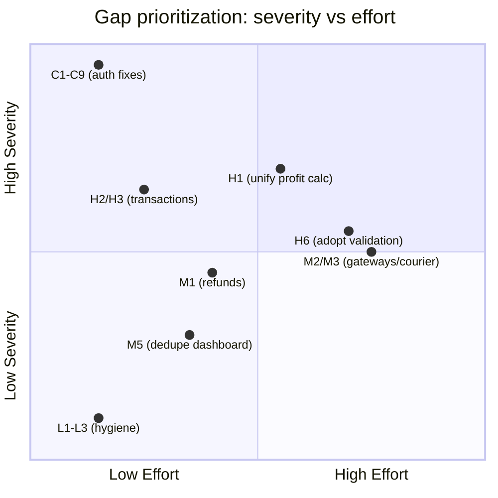

# 10 — Gap Analysis: Current State vs. Target Enterprise State

Effort estimates are rough order-of-magnitude (engineer-days for one mid-level engineer), meant for prioritization discussion, not committed estimation. Full backlog with acceptance criteria is in `15_Implementation_Backlog.md`.

## Critical (fix before anything else; production-risk today)

| # | Gap | Current state | Target state | Effort |
|---|---|---|---|---|
| C1 | Unauthenticated admin user-management endpoint | `PATCH /api/admin/users` allows full unauthenticated privilege escalation | Every admin route requires verified JWT + role/permission check | 0.5–1 day |
| C2 | ~12 other unauthenticated admin routes | See `08_Security_Assessment.md` §1.3–1.6 | Same | 2–3 days (mechanical, same fix pattern repeated) |
| C3 | Unverified `x-user-id` header used as identity | `checkPermission()` trusts a client-supplied header | Identity always derived from a verified JWT | 1–2 days |
| C4 | Unauthenticated order-detail IDOR | `GET /api/orders/[id]` leaks customer PII to anyone | Ownership-or-admin check, matching `orders/cancel`'s existing pattern | 0.5 day |
| C5 | Unauthenticated RFQ surface | List/create/respond all unauthenticated; create trusts client-supplied `userId` | Auth + ownership scoping on all three | 1 day |
| C6 | Wildcard CORS + credentials on all API routes | `Access-Control-Allow-Origin: *` + credentials:true globally | Per-route CORS policy; no wildcard+credentials combination anywhere | 1 day |
| C7 | Hardcoded JWT secret fallbacks | Three different literal fallback strings across the codebase | Fail fast at boot if `JWT_SECRET` unset; no fallback ever | 0.5 day |
| C8 | Password hash returned to client | `GET /api/user/profile` has no `select`, leaks bcrypt hash | Shared "safe user" projection used everywhere a User is serialized | 0.5 day |
| C9 | Broken password-reset flow | Frontend calls a backend endpoint that doesn't exist | Implement `/api/auth/forgot-password` + `/reset-password`, or remove the frontend entry point until it exists | 2–3 days |

**Total Critical effort: roughly 1.5–2 engineer-weeks**, almost entirely low-complexity, high-value fixes — this is disproportionately cheap relative to the risk it removes and should be sequenced as a standalone patch release ahead of any other work in this backlog.

## High (correctness/integrity risk, not immediately exploitable but materially wrong)

| # | Gap | Current state | Target state | Effort |
|---|---|---|---|---|
| H1 | Four independent, non-reconciling profit calculators | `profitCalculation.ts`, `comprehensiveProfitCalculation.ts`, `partnerProfitDistribution.ts`, `orderFulfillmentService.ts` each compute profit differently from different sources | One canonical profit-calculation domain service; others deleted or refactored to call it | 1–2 weeks |
| H2 | Non-atomic order cancellation / stock restoration | Both cancellation endpoints restore stock via a sequential loop outside any transaction | Wrap in `$transaction`, matching the pattern already correct in `orderFulfillmentService.ts` | 1–2 days |
| H3 | Non-atomic profit finalization; ledger failures silently swallowed | `autoGenerateProfitReport` isn't transactional; ledger-post failures are caught and ignored | Transactional finalization; surfaced/retryable failure handling (candidate for the event-driven pattern in `11_Target_Architecture.md`) | 3–5 days |
| H4 | Order-fulfillment service (correct, FIFO/WAC) is dead code; simpler snapshot logic is what's actually live | `orderFulfillmentService.ts` unused | Decide: wire it in (accurate COGS) or delete it (reduce confusion) — either is acceptable, leaving it as-is is not | 3–5 days to wire in, 0.5 day to delete |
| H5 | Order-based sales not auto-generated on delivery | `autoGenerateSalesFromOrder` is dead; only a manual admin trigger exists | Wire the existing (already-written) auto-trigger into the delivery-status transition | 1 day |
| H6 | Zod validation and shared error-handler exist but aren't used | Manual, inconsistent, weaker validation/error-handling live in production routes | Migrate routes incrementally onto the existing `lib/validation.ts`/`lib/error-handler.ts` | 2–3 weeks (incremental, can be spread over many small PRs) |
| H7 | No general API rate limiting | `rate-limiter.ts` fully built, unused everywhere including login/register | Wire `rateLimiters.auth` into login/register at minimum; broaden from there | 2–3 days |
| H8 | Test suite partially tests itself, not production code | `profit-calculations.test.ts`, `deletion-transitions.test.ts` import no application code | Rewrite against real functions/routes; add integration tests for order creation/cancellation/delivery flows | 1–2 weeks |
| H9 | Missing DB indexes on hot filter columns | No `@@index` on `Product.categoryId/sellerId/isActive/isFeatured`, several FK columns | Add indexes; measure query plans before/after | 1–2 days |
| H10 | Three unauthenticated/inconsistent data-deletion endpoints | `/api/data-deletion`, `/api/data-deletion-request`, `/api/data-deletion-requests` overlap | Consolidate to one, consistently authenticated endpoint | 2–3 days |

## Medium (real gaps, not urgent, but expected of an enterprise system)

| # | Gap | Target state | Effort |
|---|---|---|---|
| M1 | No returns/refunds system despite policy promising one | `Refund`/`Return` model + API + admin workflow | 3–5 days |
| M2 | No real payment gateway integration | Integrate at least one of bKash/Nagad/SSLCommerz behind a proper adapter/ACL | 1–2 weeks per gateway |
| M3 | No shipping/courier integration, no tracking numbers | Integrate at least one courier API (Pathao/RedX/Steadfast) | 1–2 weeks |
| M4 | No real notification system | Wire `RESEND_API_KEY` (already in `.env.example`) to actual order-status emails at minimum | 3–5 days |
| M5 | Duplicate `/dashboard/*` admin panel | Deprecate and remove in favor of `/admin/*`, or formally repurpose it with a stated distinct audience | 3–5 days (mostly deletion + redirect) |
| M6 | Two Prisma client singletons | Consolidate to one, exported from one module | 0.5 day |
| M7 | No CI pipeline | Add a GitHub Actions (or equivalent) workflow running lint/typecheck/tests on every PR | 1 day |
| M8 | Employee and User identity fully disconnected | Optional `User` link on `Employee`, or an explicit decision that they stay separate | Design decision + 1–2 days |
| M9 | Three disconnected "profit-sharing party" concepts | Stakeholder decision (see `02_Business_Requirements.md` §6), then consolidate | Design decision + 1–2 weeks |
| M10 | Cart pricing preview diverges from checkout pricing | Cart should call the real pricing engine for its preview total | 2–3 days |
| M11 | Doc-corpus sprawl (150+ overlapping/contradictory files) | Consolidate to this 15-document set + a lightweight living README; archive or delete the rest | 2–3 days |
| M12 | SEO gaps (dead JSON-LD components, client-mutated metadata on PDP, domain-name inconsistency) | Wire `ProductSchema`/`BreadcrumbSchema` in with proper escaping; move PDP metadata to `generateMetadata`; fix domain consistency | 3–5 days |

## Low (polish / hygiene)

| # | Gap | Target state | Effort |
|---|---|---|---|
| L1 | Dead code inventory (`.bak`/`.backup` files, `ordersStore.ts`, unused `pg` dependency, empty `ToastTest.tsx`) | Delete | 0.5 day |
| L2 | `test-upload` dev page shipped to production | Remove or gate behind a build flag | 0.5 day |
| L3 | 120 `console.log` statements | Remove or replace with the existing `lib/logger.ts` | 1 day |
| L4 | Warehouse model orphaned | Build out or remove | 1 day (remove) / 1–2 weeks (build out) |
| L5 | `Unit` lookup table orphaned | Wire `Product.unit` to it via FK, or remove `Unit` | 1 day |
| L6 | Inconsistent response envelopes/pagination shapes across API | Adopt one shared response/pagination helper codebase-wide | Folded into H6's incremental migration |

## Summary view

Read `12_Refactoring_Roadmap.md` for how these gaps sequence into phases, and `15_Implementation_Backlog.md` for ticket-level detail on each item.
