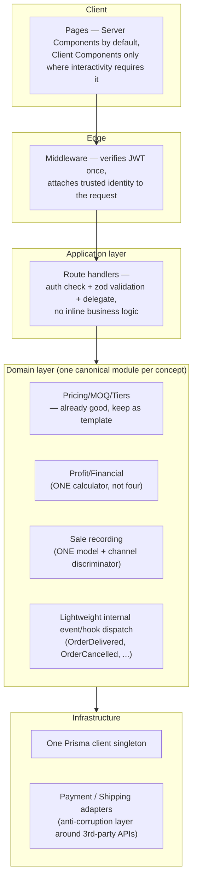

# 11 — Target Architecture

This is a proposed **destination**, reached incrementally via `12_Refactoring_Roadmap.md` — it is not a rewrite plan. The system stays a Next.js monolith; the changes are internal-organization changes (consistent layering, one auth path, one domain model per concept), not a platform change. Nothing here should be read as "rebuild from scratch."

## 1. Guiding principle

**Fix consistency before fixing shape.** The current architecture's problems are overwhelmingly about *multiple incompatible ways of doing the same thing* (four auth mechanisms, four profit calculators, three sale-recording models, two admin panels) rather than about the wrong overall shape (Next.js monolith + Prisma + Postgres remains the right choice at this scale). The target architecture therefore prioritizes **consolidation to one canonical implementation per concept** over introducing new architectural layers or patterns.

## 2. Target layering

## 3. Target auth model

One path, used everywhere: Next.js middleware (or a single shared request-wrapper function, if edge middleware can't carry Prisma lookups) verifies the JWT and resolves the acting `User` once; route handlers receive a trusted identity and call a single `authorize(user, permission)` function that consults **one** permission model (see §4) rather than choosing between four mechanisms. `checkPermission()`'s `x-user-id`-header trust is retired entirely, not patched in place — it should not exist in any form once the target state is reached. This directly closes `08_Security_Assessment.md`'s Critical findings as a side effect of the consolidation, not as a separate effort.

## 4. Target authorization model

Collapse the two currently-disconnected systems (static `ROLE_PERMISSIONS` map + DB-backed `UserPermission`) into one: keep the DB-backed granular permission table as the source of truth (it's the more flexible of the two and already models what's needed — 30+ modules × 6 actions), and derive each role's *default* permission set from it at seed/migration time rather than maintaining a separate, parallel hardcoded map that can drift out of sync with the database. A role becomes "a named bundle of default permissions," not a second, independent authorization axis.

## 5. Target domain model consolidation

Per `05_Domain_Model.md` §4, three consolidations are needed, in priority order:

1. **Profit calculation** — one domain service, one formula, one revenue/cost source of truth per calculation type (order-level vs. period-level), called by every consumer (order delivery, sales generation, partner distribution, dashboards). The four existing implementations become either thin call-throughs to this service or are deleted.
2. **Sale recording** — one `Sale`/`Transaction` model with a `channel` enum (`ONLINE`, `DIRECT`, `MANUAL`) rather than three separate models with independently-duplicated cost/profit snapshot fields. This is a schema migration, not just a code change, and should be planned carefully (data migration for existing `Order`/`Sale`/`ManualSalesEntry` rows).
3. **Profit-sharing party** — ✅ **RESOLVED, ADR-008 (2026-07-18)**. `User.isProfitPartner` deleted (confirmed dead). `Partner` (net-company-profit-share) and `Product.sellerId` (per-product commission) remain two distinct, separately-computed concepts, not merged — a domain investigation found no evidence they were ever intended as one relationship, and found a genuine external-supplier concept doesn't exist in this system at all (inventory is platform-owned throughout). `Partner` gained an optional `userId` FK to `User` for portal-login access and for the case where the same person is both a co-owner and a product seller — `Product.sellerId` continues to reference `User` directly, not `Partner`; a seller-who-is-also-a-partner is reachable via `Product.sellerId → User → User.partner`. See `13_ADRs.md` ADR-008.

## 6. Target event model (lightweight, not a message queue)

Introduce a minimal in-process event/hook dispatcher (e.g., an `emitDomainEvent('OrderDelivered', {orderId})` call at the end of the status-transition handler, with registered handlers for sale generation, profit finalization, and ledger posting). This is deliberately **not** a proposal to introduce Kafka/SQS/a message broker — at this scale and single-deployment-unit architecture, an in-process dispatcher that runs its handlers inside the same request (or a `after()`-style deferred callback) is sufficient, and importantly makes the current "ledger posting silently swallows failures" problem (`03_Current_Architecture.md` §4) visible and testable in one place instead of buried in a `try/catch` inside a profit-report-generation function. A move to a real queue only becomes warranted if/when these side effects need to survive a serverless function timeout or be retried independently — not before.

## 7. Target integration boundary for payment/shipping

Before integrating a real payment gateway (bKash/Nagad/SSLCommerz) or courier API (Pathao/RedX/Steadfast), introduce a thin adapter interface (`PaymentGateway`, `ShippingProvider`) that the application calls, with gateway-specific request/response shapes confined entirely to the adapter implementation. This prevents the current mock's shape (`'BKS-' + Date.now()`-style fake transaction IDs baked directly into route logic) from becoming load-bearing once real integration work starts, and gives a natural seam for adding a second provider later without touching `Order`/`Payment` domain code.

## 8. Target frontend architecture

- **One admin surface.** Retire `/dashboard/*` (or explicitly repurpose and rename it if it's meant to serve a genuinely different audience than `/admin/*` — but as found, it currently duplicates the same audience and the same resources).
- **One shared data-access layer** for admin/dashboard/partner/customer pages, mirroring the pattern that already works for the public storefront (`hooks/` → `services/dataService.ts` → `services/apiService.ts`), instead of each page hand-rolling `fetch` + token-header + response-shape logic.
- **Server Components as the default** for pages that don't need client interactivity, reserving `'use client'` for genuinely interactive surfaces (forms, carts, live filters) — reduces the current all-client-component pattern's duplication of data-fetching logic and improves the SEO/metadata issues noted in `04_Module_Analysis.md` #33.
- **A small set of shared primitives** (Button, Input, Card, Modal) to sit alongside the already-good `EmptyState`/`ErrorState`/`Skeleton` components, ending the current copy-pasted-Tailwind-per-page pattern.

## 9. What deliberately stays the same

- Next.js App Router monolith on Vercel — right choice at this scale, no case for splitting into services.
- Prisma + Postgres (Neon) — right choice; fix indexing/connection issues (`06_Database_Analysis.md`), don't replace.
- JWT-based auth (vs. switching to a session-store model) — reasonable for a stateless API; the fix is consistency of enforcement, not the mechanism itself.
- The pricing engine's design — this is the one subsystem to actively use as the template for how the rest of the domain layer should look (pure functions, thorough unit tests, single call path).

## 10. Success criteria for "target state reached"

1. Every route in `07_API_Analysis.md`'s tables passes through exactly one auth/authorization code path.
2. Grepping the codebase for "profit" calculation logic finds one call path, not four.
3. `/dashboard/*` either no longer exists or is demonstrably serving a different, documented audience than `/admin/*`.
4. A new engineer can answer "how is a sale recorded" and "who shares in profit" by reading one model each, not reconciling three.
5. CI runs lint + typecheck + the full Jest suite on every PR (currently: none).
