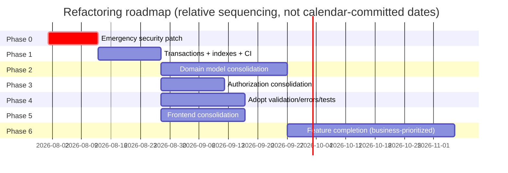

# 12 — Refactoring Roadmap

Phased path from current state to the target state in `11_Target_Architecture.md`. Each phase is independently shippable; none requires a big-bang rewrite or downtime. Effort figures roll up from `10_Gap_Analysis.md`.

## Phase 0 — Emergency security patch (~1.5–2 weeks, do this first, in isolation)

Ship `08_Security_Assessment.md`'s Critical findings (C1–C9 in `10_Gap_Analysis.md`) as a standalone patch release, decoupled from everything else in this roadmap. These are individually small, mechanical fixes (mostly "add the auth check that's already correct elsewhere in the same file") and should not wait for any architectural consolidation work. Do not batch this with feature work or refactors — a security patch should be reviewable and revertible in isolation.

**Exit criteria**: every route enumerated in `08_Security_Assessment.md` §1 has a verified auth check; `JWT_SECRET` has no fallback; CORS is no longer wildcard+credentials globally.

## Phase 1 — Stop the bleeding on integrity (~2–3 weeks)

Fix the non-atomic financial/inventory operations before doing any larger consolidation, since consolidating four profit calculators into one is much safer once the transaction boundaries around them are already correct.

- H2: wrap order-cancellation stock restoration in a transaction.
- H3: make profit finalization transactional; stop silently swallowing ledger-post failures (this is also the natural first use case for the event-dispatch mechanism in `11_Target_Architecture.md` §6 — introduce the minimal dispatcher here rather than waiting for Phase 3).
- H9: add the missing DB indexes (cheap, safe, immediately measurable).
- M6: consolidate the two Prisma client singletons to one.
- M7: stand up CI (lint + typecheck + jest on every PR) — every subsequent phase becomes safer once this exists.

**Exit criteria**: no financial or inventory mutation happens outside a transaction; CI blocks merges on lint/typecheck/test failure.

## Phase 2 — Consolidate the domain model (~4–6 weeks)

The core "pick one implementation" work, sequenced by dependency order (profit calculation depends on knowing what a sale is, so sales come first):

1. **H5 + prerequisite for H1**: decide and implement the sale-recording consolidation (`Order`/`Sale`/`ManualSalesEntry` → one model + channel discriminator, per `11_Target_Architecture.md` §5.2). Wire the existing (already-written) auto-sale-generation-on-delivery logic into the new unified path.
2. **H1**: consolidate the four profit calculators into one domain service, built to consume the now-unified sale-recording model.
3. **M9**: once a stakeholder decision is made (`02_Business_Requirements.md` §6), consolidate the three profit-sharing-party representations.
4. **H4**: decide the fate of `orderFulfillmentService.ts` (wire in for accurate FIFO/WAC COGS, or delete) as part of the same profit-calculation consolidation, since it's a fifth de facto profit-calculation path.

This phase touches the schema (migrations for the sale-model consolidation) and should be planned with a data-migration script and a rollback plan, not just a code change — treat it with the same care as the original `migrate_product_pricing_schema` migration, but with an explicit migration plan document this time (see `13_ADRs.md`'s recommendation to write the ADR *before* executing this one).

**Exit criteria**: `11_Target_Architecture.md` §10, points 2 and 4.

## Phase 3 — Consolidate authorization (~2–3 weeks)

Deliberately sequenced *after* Phase 0's emergency patches (which make individual routes safe immediately) rather than before — Phase 0 fixes "is this route protected," Phase 3 fixes "is protection implemented the same way everywhere."

- Retire `checkPermission()`'s header-trust mechanism entirely (already neutralized functionally in Phase 0, removed structurally here).
- Retire the bespoke per-file `verifyPartner()` implementations and the deprecated inline `verifyAdminToken` in favor of one shared middleware/wrapper.
- Collapse the static `ROLE_PERMISSIONS` map and the DB-backed `UserPermission` table into one model, per `11_Target_Architecture.md` §4.
- Migrate routes one-by-one onto the single wrapper; this is safe to do incrementally since each route change is independently testable and revertible.

**Exit criteria**: `11_Target_Architecture.md` §10, point 1.

## Phase 4 — Adopt existing-but-unused infrastructure (~3–4 weeks, can run in parallel with Phase 3)

Lower-risk, high-value work that doesn't require design decisions — just adoption of code that already exists:

- H6: migrate routes onto `lib/validation.ts` (zod) and `lib/error-handler.ts` incrementally, a handful of routes per PR.
- H7: wire `rate-limiter.ts` into login/register first, then broaden to write-heavy endpoints.
- H8: rewrite the two tautological test files against real code; add integration tests for order creation, cancellation, and delivery (the highest-risk, currently-untested flows per Phase 1's transaction fixes).

**Exit criteria**: `lib/validation.ts`/`lib/error-handler.ts`/`rate-limiter.ts` usage is the norm, not the exception, across `src/app/api`.

## Phase 5 — Frontend consolidation (~3–4 weeks, can run in parallel with Phases 3–4)

- M5: retire or explicitly repurpose `/dashboard/*`.
- Build the shared admin/partner/customer data-access layer (`11_Target_Architecture.md` §8).
- Introduce shared Button/Input/Card/Modal primitives.
- M12: fix SEO gaps (wire dead JSON-LD components with proper escaping, move PDP metadata to `generateMetadata`, fix the `skyzonebd.com`/`skyzonebd.shop` inconsistency).

**Exit criteria**: `11_Target_Architecture.md` §10, point 3.

## Phase 6 — Feature completion (business-prioritized, not sequenced here)

M1 (refunds), M2 (payment gateway), M3 (shipping/courier), M4 (notifications) are genuine new-feature work, not refactoring, and should be prioritized by the business against other roadmap items rather than slotted into this technical sequence. `11_Target_Architecture.md` §7's adapter-boundary recommendation should be followed **before** M2/M3 implementation starts, regardless of when the business chooses to schedule them.

## Ongoing, throughout every phase

- L1–L3: delete dead code and the `test-upload` page opportunistically as each phase touches nearby files — don't schedule a dedicated phase for this, it's not worth the coordination overhead.
- M11: consolidate the 150+ root markdown docs into this 15-document set once it's approved; archive (don't silently delete) the originals in case any contain undiscovered project history.

## Sequencing diagram

