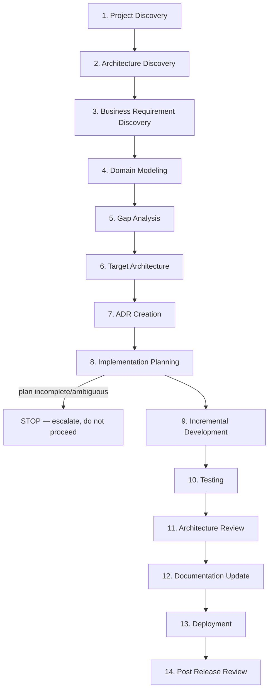

# 02 — Development Lifecycle

Fourteen phases, executed in order for every Tier 3 task, scoped down (but never skipped — see `00_Agentic_Engineering_Workflow.md` §5) for Tier 1/2 tasks. Each phase names its purpose, required inputs, activities, expected outputs, completion criteria, and responsible agent(s).

---

### Phase 1 — Project Discovery

**Purpose**: Establish what is being asked for and how big it is, before any technical thinking starts.
**Inputs**: Stakeholder request; existing backlog (`docs/architecture-review/15_Implementation_Backlog.md` or its successor); prior Work Items if this is a continuation.
**Activities**: Restate the request in the team's own words; classify task tier; identify which prior architecture-review findings (if any) this touches.
**Outputs**: Task tier classification; initial problem statement.
**Completion criteria**: Product Manager Agent and Principal Engineer Agent agree on tier and problem statement.
**Responsible agent(s)**: Product Manager Agent (lead), Principal Engineer Agent (confirms tier).

### Phase 2 — Architecture Discovery

**Purpose**: Confirm current understanding of the parts of the system this task touches is accurate and current (not stale, per the architecture review's core lesson about trusting outdated documentation).
**Inputs**: `docs/architecture-review/03_Current_Architecture.md`, `04_Module_Analysis.md`; the actual current source for the affected module(s) — re-verified, not assumed from documentation alone.
**Activities**: Re-confirm the affected module's current implementation directly against source for anything the task will touch; note any drift from the last recorded architecture review.
**Outputs**: A short "current state confirmed" note for the affected module(s), or a flagged discrepancy if documentation and code disagree.
**Completion criteria**: No open discrepancy between documentation and code for the affected area, or the discrepancy is explicitly logged and routed to Documentation Agent.
**Responsible agent(s)**: Solution Architect Agent (lead), Domain Architect Agent.

### Phase 3 — Business Requirement Discovery

**Purpose**: Fully specify what business outcome is required, resolving ambiguity before technical design.
**Inputs**: Phase 1 problem statement; `docs/architecture-review/02_Business_Requirements.md`; stakeholder availability for clarification.
**Activities**: Decompose into functional requirements and acceptance criteria; explicitly identify any assumption being made and route it for confirmation rather than silently encoding it.
**Outputs**: Filled Business Requirement + Acceptance Criteria sections of the Work Item (`08_Work_Item_Template.md`).
**Completion criteria**: No unresolved "[ASSUMPTION]"-tagged item remains without either stakeholder confirmation or explicit written acceptance of the assumption by the Product Manager Agent.
**Responsible agent(s)**: Business Analyst Agent (lead), Product Manager Agent.

### Phase 4 — Domain Modeling

**Purpose**: Determine where this requirement lives in the domain model and confirm it doesn't create a new parallel implementation of an existing concept.
**Inputs**: `docs/architecture-review/05_Domain_Model.md`; Business Requirement from Phase 3.
**Activities**: Identify the affected aggregate(s)/bounded context(s); check whether an existing canonical implementation should be extended instead of a new one created; flag if the requirement touches one of the three unresolved domain-modeling questions (sale-recording, profit-sharing party, profit calculation).
**Outputs**: Domain model impact statement; a decision on which existing model/service is authoritative for this change.
**Completion criteria**: Domain Architect Agent confirms no new parallel implementation is being introduced without an approved ADR exception.
**Responsible agent(s)**: Domain Architect Agent (lead), Solution Architect Agent.

### Phase 5 — Gap Analysis

**Purpose**: Identify precisely what's missing between current state and what the requirement needs.
**Inputs**: Domain model impact statement; current architecture; current database schema.
**Activities**: List concrete gaps (missing endpoint, missing field, missing validation, missing test coverage) with severity, in the same style as `docs/architecture-review/10_Gap_Analysis.md`.
**Outputs**: A scoped gap list specific to this task.
**Completion criteria**: Every gap has an owner (which later phase/agent closes it).
**Responsible agent(s)**: Solution Architect Agent (lead), relevant domain agents (Database Architect, Security Engineer, Performance Engineer as applicable).

### Phase 6 — Target Architecture

**Purpose**: Define what "done" looks like architecturally for this specific task, consistent with `docs/architecture-review/11_Target_Architecture.md`.
**Inputs**: Gap list; target architecture document.
**Activities**: Sketch the specific target shape (new endpoint contract, new component structure, schema change) at a level of detail sufficient to plan implementation.
**Outputs**: Task-scoped target architecture sketch.
**Completion criteria**: Solution Architect Agent confirms the sketch doesn't conflict with the project-wide target architecture.
**Responsible agent(s)**: Solution Architect Agent (lead), Backend/Frontend Engineer Agents (feasibility input).

### Phase 7 — ADR Creation

**Purpose**: Record any consequential decision made in Phases 4–6, per the criteria in `04_Decision_Framework.md`.
**Inputs**: Decisions made so far; existing ADR log.
**Activities**: Write the ADR (Problem/Context/Constraints/Alternatives/Trade-offs/Decision/Consequences/Future risks/Architecture alignment/Business impact); this phase is skipped only if `04_Decision_Framework.md`'s criteria confirm no ADR is required for this task's tier/impact.
**Outputs**: A new or updated ADR entry.
**Completion criteria**: For Tier 3 tasks, an ADR exists and is ratified per `10_Project_Governance.md` before Phase 8 begins.
**Responsible agent(s)**: Solution Architect Agent (lead, drafts), Principal Engineer Agent (ratifies), human project owner (ratifies for Tier 3).

### Phase 8 — Implementation Planning

**Purpose**: Produce a concrete, reviewable plan before any code is written.
**Inputs**: All prior phase outputs.
**Activities**: List files to be touched/created; list the specific changes per file; identify test plan; identify rollback plan; identify documentation that will need updating.
**Outputs**: Completed Implementation Plan section of the Work Item.
**Completion criteria**: Principal Engineer Agent confirms the plan is complete and internally consistent with all prior phases before implementation starts. **If any required input is missing or ambiguous, STOP here and escalate — do not proceed to Phase 9 on an incomplete plan.**
**Responsible agent(s)**: Backend/Frontend/Database Architect Agents (draft, per their domain), Principal Engineer Agent (approves).

### Phase 9 — Incremental Development

**Purpose**: Implement the approved plan in small, safe, reviewable increments.
**Inputs**: Approved Implementation Plan.
**Activities**: Implement in the smallest safe increments the plan allows; commit/checkpoint frequently; do not silently expand scope beyond the approved plan (if scope must expand, return to Phase 8).
**Outputs**: Working code matching the plan.
**Completion criteria**: Every planned change is implemented; no unplanned scope was added without a documented plan revision.
**Responsible agent(s)**: Backend Engineer Agent, Frontend Engineer Agent, Database Architect Agent (as applicable).

### Phase 10 — Testing

**Purpose**: Verify the implementation actually does what was planned — genuinely, not tautologically (per the architecture review's specific finding about tests that assert against themselves rather than real code).
**Inputs**: Implemented code; test plan from Phase 8.
**Activities**: Write/execute unit and integration tests exercising the real implementation; confirm tests would fail if the implementation were reverted (a basic mutation-testing sanity check); run the full existing suite to check for regressions.
**Outputs**: Test results; coverage report.
**Completion criteria**: All planned tests exist, pass, and demonstrably exercise the real code path; no regression in the existing suite.
**Responsible agent(s)**: QA Engineer Agent (lead), Backend/Frontend Engineer Agents (write tests alongside implementation).

### Phase 11 — Architecture Review

**Purpose**: Independent check that the implementation matches the approved architecture/domain-model decisions from Phases 4–7, not just that it "works."
**Inputs**: Implemented, tested code; Phases 4–7 outputs.
**Activities**: Confirm no new parallel implementation was introduced; confirm the canonical shared modules were used (auth, validation, error-handling, pagination); confirm security and performance implications were addressed.
**Outputs**: Architecture compliance verdict.
**Completion criteria**: Solution Architect Agent, Security Engineer Agent, and Performance Engineer Agent all sign off; Code Reviewer Agent's findings are resolved.
**Responsible agent(s)**: Solution Architect Agent (lead), Security Engineer Agent, Performance Engineer Agent, Code Reviewer Agent.

### Phase 12 — Documentation Update

**Purpose**: Ensure documentation reflects the change immediately, not eventually — the direct countermeasure to this project's 150+-file documentation-sprawl history.
**Inputs**: Merged/approved implementation; the mandatory documentation set (`05_Documentation_Standards.md`).
**Activities**: Update existing documents (architecture, domain model, API reference, ADR log, changelog) — do not create a new one-off "implementation summary" file.
**Outputs**: Updated documentation, verified against the Documentation Standards checklist.
**Completion criteria**: Documentation Agent confirms every required document type affected by this change has been updated.
**Responsible agent(s)**: Documentation Agent (lead), Technical Writer Agent (polish).

### Phase 13 — Deployment

**Purpose**: Ship the change safely.
**Inputs**: Fully gated Work Item (all prior phases complete); deployment/rollback plan.
**Activities**: Execute deployment per DevOps Agent's pipeline; confirm migrations (if any) run against the correct database connection; monitor immediate post-deploy health.
**Outputs**: Deployed change; deployment record.
**Completion criteria**: Deployment succeeds; smoke checks pass; rollback plan remains available for a defined monitoring window.
**Responsible agent(s)**: DevOps Agent (lead), Release Manager Agent (go/no-go).

### Phase 14 — Post Release Review

**Purpose**: Close the loop — confirm the business outcome was actually achieved and capture lessons for the workflow itself.
**Inputs**: Deployed change; original acceptance criteria; any post-deploy monitoring signal.
**Activities**: Verify acceptance criteria are met in production; capture any process lesson (e.g., a phase that surfaced a problem worth adding as a standing check); update the technical debt register if any shortcut was taken under time pressure.
**Outputs**: Post-release review note; any workflow-improvement suggestion routed per `10_Project_Governance.md` §4.
**Completion criteria**: Product Manager Agent confirms the business outcome is met; Principal Engineer Agent formally closes the Work Item.
**Responsible agent(s)**: Product Manager Agent (business confirmation), Principal Engineer Agent (formal close).

---

## Phase flow diagram

