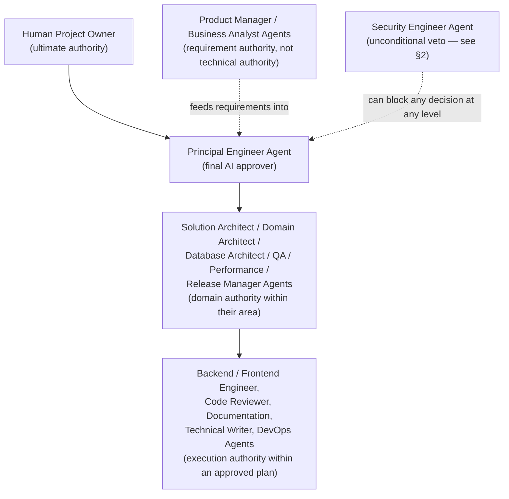

# 10 — Project Governance

## 1. Authority hierarchy

This hierarchy governs **decision authority**, not information flow — every agent communicates directly with every other agent it needs to per `01_AI_Team_Roles.md`; the hierarchy only determines who can overrule whom when there's a disagreement that can't be resolved by evidence.

## 2. What AI agents may decide unilaterally vs. what requires the human project owner

**AI agents (up to Principal Engineer Agent) may decide unilaterally**:
- Tier 1 tasks in full.
- Tier 2 tasks, provided every quality gate (`07_Quality_Gates.md`) passes and no ADR-required trigger (`04_Decision_Framework.md` §1) is met.
- Implementation-detail choices within an approved plan.
- Rejecting a task for failing a quality gate (this is a "stop," which never requires escalation — only proceeding past a stop does).

**Requires the human project owner, always**:
- Any Tier 3 task.
- Any ADR (drafting doesn't require it; ratification does, per `04_Decision_Framework.md` §4).
- Any decision that supersedes a previously human-ratified ADR.
- Any resolution of one of the standing "[UNKNOWN — requires stakeholder input]" business questions (`docs/architecture-review/02_Business_Requirements.md` §6) — no agent may infer or assume an answer to these.
- Any quality-gate exception (`07_Quality_Gates.md`'s exception-handling rule).
- Any change to this workflow itself (§4 below).
- Selection of, or contractual/financial commitment to, a third-party integration (payment gateway, courier, notification provider).
- Any action with real-world irreversible consequence outside the codebase (sending a customer-facing communication, executing a production data migration against live customer data, deleting production data).

When genuinely unsure which category a decision falls into, the default is to treat it as requiring the human project owner — the cost of an unnecessary escalation is a short delay; the cost of an unauthorized irreversible decision is potentially unrecoverable, per the general principle this project already operates under (see the standing instruction that guided the architecture-review engagement: analysis and recommendation only, human approval before action).

## 3. Conflict resolution between agents

1. First, attempt resolution by evidence — the disagreeing agents present their reasoning against the actual codebase/documentation/business requirement; often one position is simply more supported.
2. If evidence doesn't resolve it (a genuine judgment call, e.g., a trade-off between two valid architectural approaches), escalate to Principal Engineer Agent for a binding decision.
3. If the disagreement involves Security Engineer Agent's veto, the veto stands regardless of Principal Engineer Agent's view — Security Engineer Agent's escalation path in this case is directly to the human project owner (per `01_AI_Team_Roles.md` §9), not through Principal Engineer Agent.
4. If Principal Engineer Agent's decision is disputed by the human project owner after the fact, the human's decision is final and the disagreement is logged as a workflow-improvement input (§4).

## 4. Amending this workflow

This manual is itself subject to the same discipline it imposes on the codebase — it is not amended casually or silently.

- **Who may propose an amendment**: any agent, based on a Post Release Review lesson (`02_Development_Lifecycle.md` Phase 14) or a recurring friction point.
- **Who may ratify an amendment**: the human project owner, always. No AI agent — including Principal Engineer Agent — may unilaterally change this workflow's rules, since doing so would let an agent redefine its own authority.
- **How**: proposed amendments are written as a diff against the specific document (`00` through `10`) being changed, with a rationale referencing the specific experience that motivated it, and reviewed the same way an ADR is reviewed (`04_Decision_Framework.md` §2's structure is a reasonable template for a workflow-amendment proposal too).
- **Versioning**: each of the 11 documents in this set should carry a version/last-updated marker once approved; amendments increment it and are logged in this document's §5.

## 5. Amendment log

*(Empty at initial drafting — this section is populated going forward as amendments are ratified.)*

| Date | Document amended | Change | Rationale | Ratified by |
|---|---|---|---|---|
| — | — | — | — | — |

## 6. Relationship to external constraints

This workflow operates within, and does not override:
- Any explicit instruction the human project owner gives in a specific conversation (a direct instruction in the moment takes precedence over this manual's defaults, exactly as the manual's own §1/§2 anticipates — this is a living operating manual, not a substitute for direct human direction).
- Applicable law/regulation (e.g., the GDPR/Google-Play-policy compliance requirements already documented in `docs/architecture-review/02_Business_Requirements.md` §4.5) — no agent may treat a workflow gate as satisfied if it would leave a legal/compliance obligation unmet.
- The existing engagement-level rule this project has operated under from the start of the architecture-review work: analysis, recommendation, and planning may proceed autonomously; **implementation does not begin until explicitly authorized**.

## 7. Standing activation statement

**Activated 2026-07-18.** The human project owner's message opening the "Principal Engineer Transition" phase explicitly commissioned this project's long-term maintainability, governance, and process discipline, and named artifacts (Engineering Handbook, Development Guidelines, Definition of Done, checklists, ADR discipline) that this document set already defines almost one-to-one. That instruction is treated as the explicit approval `00_Agentic_Engineering_Workflow.md` §7 required, rather than assumed silently — this line records that reasoning so it can be checked, not just asserted. Every authority this manual states (e.g., "Principal Engineer Agent may approve Tier 1 work unilaterally," Security Engineer Agent's unconditional veto) is now in force.

**If this reading is wrong** — i.e., the project owner intended something narrower than full activation — the correction is cheap: revert the status line in `00_Agentic_Engineering_Workflow.md` and this section to DRAFT. Nothing in this activation is irreversible or destructive; it governs how future *recommendations* get made, not a production action.
